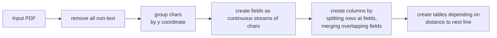

# Content
1. [Introduction](#intro)
   1. [GTFS](#intro_1)
2. [Implementation](#impl)
   1. [Getting timetable data](#impl_1)
   2. [Creating GTFS](#impl_2)
   3. [Finding stop locations](#impl_3)
3. [BBB](#bbb)

# Introduction {#introduction}
First of all, there is 
## GTFS {#intro_1}
[GTFS](https://developers.google.com/transit/gtfs/reference) 
is the de-facto standard format for public transit data.
It consists of different files, which are usually packed into an archive.

Most notably (you can find the full specification 
[here](https://developers.google.com/transit/gtfs/reference)):
* `agency.txt` contains information to identify the [agencies)] that perform the
transportation
* `stops.txt` contains stop identifier/names and their locations
* `routes.txt` [information about the route, esp. route_type]
* `calendar.txt` [different entry for different days]
* `trips.txt` [basically maps routes to calendar]
* `stop_times.txt`

## BBox and coordinates
...

# Implementation {#impl}??? not really implementation?
The problem of getting from a timetable in a pdf to a valid gtfs archive, can roughly be 
split into three sub-problems.



## Getting timetable data {#impl_1}
In the first step we read the pdf file and create our own datastructure 
`TimeTable`, which will need to hold all necessary information to perform the other steps.

To create a `TimeTable`, all characters in the pdf are grouped by their y-coordinate 
to discern different lines and grouped into `Field` objects based on their x-coordinates.
Finally the `Field` objects are used to create intermediate objects `PDFTable`, 
which are then used to create the `TimeTable`.

### Fields, Rows and Columns
Each `Field f`  contains chars, such that `char1.x1 - char2.x0 <= some_tolerance` 
and `char1.y0 == char2.y0` for all pairwise different chars in `f`, 
i.e. the chars are all in the same line, and each char is close to the previous one.
At the same time `f` has attributes `row` and `column`, to determine its exact position 
in the `PDFTable`.

Each `Row` contains all fields of a single line, i.e. no two rows contain fields
with the same y-coordinates and all fields in a row have the same y-coordinates.
The `Column` objects are built in the same way, except that we compare the x-coordinates.

Each of the objects `Row`, `Column` and `Field` have their own type, which is later used,
e.g. to detect which columns contain information about stops or whether a stop describes a 
vehicles arrival or its departure.
For example `Field` objects are of type `DataField`, if they contain data that can be parsed 
by `strftime()` using the given time_format. A Row/Column on the other hand is of type 
`DataRow`/`DataColumn` respectively, if any of its fields is of type `DataField`.

### PDFTable
The `PDFTable` is an intermediate datastructure, used only to group rows and columns in a 
sensible manner and to fix problems, such as two tables in the pdf being detected as a 
single table. [æ]

#### Merging and splitting PDFTables

Given two consecutive (i.r.t. their y-coordinate) `PDFTable` objects `T1` and `T2`,
if `T2` does not have a `Row` of type `HeaderRow`, then the rows of `T2` are added to `T1`.
In the same way, if `T1` and `T2` are next to each other, and `T2` does not have
a `Column` of type `StopColumn`, then the columns of `T2` are added to `T1`.

On the other hand, if a `PDFTable` contains multiple rows of type `HeaderRow` or multiple columns
of type `StopColumn`, it is split into multiple `PDFTable` horizontally or vertically respectively.


### TimeTable
The difference between `TimeTable` and `PDFTable` is the (abstract) distance to the actual pdf.
While a `PDFTable` holds all coordinate and bbox information about every `Field`, 
`Row` and `Column`, a `TimeTable` consists of stops and entries. Here stops basically 
contains information about the fields of a `PDFTable` with type `StopField` and 
each entry maps information about the arrival/departure of a single 
`DataColumn` to the respective stops.

## Creating GTFS {#impl_2}
Before trying to find the stop locations, we first transform our own datastructures
(namely the `TimeTable`) into 


## Finding stop locations {#impl_3}
The final step consists of getting publicly available location data and using this data along
with the information about the routes we have from the pdf, most notably the duration it 
takes to get from one stop to the next, and which stops are connected into a route. 
This is also the reason, why we create the GTFS files first, because it makes getting this 
information so much easier.

#### Getting the osm data
Luckily all the necessary data can be found in [OpenStreetMap](https://www.openstreetmap.org/),
which can be easily queried using for example [QLever](https://github.com/ad-freiburg/qlever).

#### Preparing the DataFrame
Once we have the locations along with the additional node information, we filter all entries in the
DataFrame, which do not contain any stop name in their names column, using a regular expression.
E.g.:
```berlin hauptbahnhof|hauptbahnhof berlin|...```

The DF also gets new columns: 
* `stop_id`: identifier for the stop, which is contained in the names column
* `node_cost`: the raw costs of the node based on the selected route type
* `name_cost`: the edit distance between any of the names and the actual (and sanitized) stop name

The `node_cost` is calculated using the additional node information. For example if the selected
route type is 'Tram', a node with the key-value-pair `'railway': 'tram_stop'` would have lower cost,
than a node with `'railway': 'station'`. At the same time, a node with the value `'tram': 'no'` 
should not be considered as possible stop location at all.

#### Finding the best locations
If we tried to calculate the distance (and therefore the travel costs) between every two 
consecutive stops for the whole route of length `n`, we would need `n * |A| * |B|` comparisons
where `|A|, |B|` would be the number of possible locations for stop `A` and `B` respectively.
Given that we also need to calculate the distance to even be able to compare them, 
it would take even longer. EW.

wHy DoNT We JUsT Do THat

In order to reduce the number of comparisons, we use the `expected_maximum_travel_distance`. 
In particular, we check for each node `a` in `A` if the difference in latitude and longitude 
is less than the maximum travel distance. 
That way we can reduce the number of times we need to calculate the actual distance 
between two locations (i.e. the part of the travel cost calculation, that is expensive) 
by several orders of magnitude. 

For example imagine we have ten locations in `A` and 1000 locations in `B`, 
we would usually need to calculate distances 10 000 times. 
If instead each location in `A` is close to only ten locations in `B` 
(which in reality is closer to 0 most of the time), we only need to calculate distances 100 times.

#### Using Dijkstra's algorithm
Now we have a DataFrame, which contains all the costs we need to use Dijkstra's algorithm
except the actual travel costs. We also know how much distance a vehicle can cover between
two stops `A` and `B`, based on the time it takes to get from `A` to `B` and the average
speed of the vehicle.


# BBB {#bbb}
TODO: Stop cost
TODO: Why use df to check for locations if we already have created all nodes?!


# BBB {#bbb}
# BBB {#bbb}
# BBB {#bbb}
# BBB {#bbb}
# BBB {#bbb}
# BBB {#bbb}
# BBB {#bbb}
# BBB {#bbb}
# BBB {#bbb}
# BBB {#bbb}
# BBB {#bbb}
# BBB {#bbb}
# BBB {#bbb}
# BBB {#bbb}
# BBB {#bbb}
# BBB {#bbb}
# BBB {#bbb}
# BBB {#bbb}
# BBB {#bbb}
# BBB {#bbb}
# BBB {#bbb}
# BBB {#bbb}
# BBB {#bbb}
# BBB {#bbb}
# BBB {#bbb}
# BBB {#bbb}
# BBB {#bbb}
# BBB {#bbb}
# BBB {#bbb}
# BBB {#bbb}
# BBB {#bbb}
# BBB {#bbb}
# BBB {#bbb}
# BBB {#bbb}
# BBB {#bbb}
# BBB {#bbb}
# BBB {#bbb}
