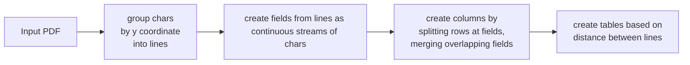

Extracting the timetable data from pdf timetables is a problem
which prevents the easy use of otherwise available data.
Though some transit agencies (esp. in Germany) provide GTFS feeds on their websites,
this project, namely pdf2gtfs, aims to prove as tool to extract this data.
It further uses information taken from
[openstreetmap.org](https://www.openstreetmap.org/) using
[QLever](https://github.com/ad-freiburg/qlever)
to find the necessary coordinates of each stop.

# Contents

1. [Introduction](#introduction)
    1. [GTFS](#gtfs)
    2. [BBox and coordinates](#character-char-and-bbox)
2. [Implementation](#implementation)
    1. [Extracting timetable data](#1-extracting-timetable-data)
    2. [Creating GTFS](#2-creating-gtfs)
    3. [Finding stop locations](#3-finding-stop-locations)
3. [Configuration](#configuration)
4. [Validation](#validation-and-testing)
5. [Conclusion](#conclusion)
6. [Future plans](#future-plans)
    1. [Multi-line stopnames](#multi-line-stopnames)
    2. [Integrity checks](#integrity-checks)
    3. [Vertical characters](#vertical-characters)
    4. [Font-based context](#font-based-context)
    5. [Increase usage of QLever](#increase-usage-of-qlever)

# Introduction

## EEEE NEED PROPER introduction

æ Preprocess where?!

### PDF

PDF files usually do not contain their text in human readable form. Instead they use a
layout-based system, where each character's position is defined using a bounding box.
This results in some difficulty in extracting text, especially, if the context of the
texts position matters.

### GTFS

[GTFS](https://developers.google.com/transit/gtfs/reference)
is the de-facto standard format for public transit information.
It defines the necessary content and format of different CSV-style textfiles.
These files are packed into a gtfs feed, which is simply a zip-archive.

[//]: # (Just using shell here, to add some highlighting)

```shell
$ cat stops.txt
stop_id,stop_name,stop_lat,stop_lon
"1","Laßbergstraße",47.98458,7.89367
"2","Römerhof",47.98618,7.88849
...
"23","Moosweiher",48.02875,7.80893

$ cat routes.txt
route_id,agency_id,route_short_name,route_long_name,route_type
"24","0",,"Laßbergstraße-Moosweiher",1

$ cat calendar.txt
service_id,monday,tuesday,wednesday,thursday,friday,saturday,sunday,start_date,end_date
"25",1,1,1,1,1,0,0,"20220101","20221231"

$ cat trips.txt
trip_id,route_id,service_id
"26","24","25"

$ head -3 stop_times.txt
trip_id,arrival_time,departure_time,stop_id,stop_sequence
"26",05:17:00,05:17:00,"1",0
"26",05:18:00,05:18:00,"2",1
...
"26",05:48:00,05:48:00,"3",22
```

> This example shows a small (and truncated) excerpt of some GTFS files.
> The exact format for each file can be found
[here](https://developers.google.com/transit/gtfs/reference#dataset_files).
>
> - `stops.txt` contains all information about the stops, including their location
> - `routes.txt` contains the name and type (here: Tram) for a route
> - `calendar.txt` contains between which start-/end-date and at which days service is active
> - `trips.txt` maps routes to service days. Here, the trip with id "26" occurs on weekdays
    > with route described in `routes.txt`
> - `stop_times.txt` contains the exact times, at which the trip is supposed to
    > arrive from and depart to each stop

### Character, Char and BBox

A character is a single letter and a `Char` is an object, which describes the
position, character and orientation of a single character in the pdf.

The `BBox` contains the coordinates of the top-left and bottom-right corners of the
rectangle, that fully encloses an object, such as a `Char`, `Field`, `Row` or `Column`
(see [Implementation](#implementation)).\
It also provides different methods, most notably the `is_close()` method, which
is used to determine whether two bounding boxes have negliable distance between
them (or touch).
> Note: The origin of the coordinates differs from the one used in the pdf.
> While the origin in pdfs is the bottom-left corner, our
> datastructures use the top-left corner.

# Introduction 2

As the name implies, the general transit feed specification (GTFS) specifies a general
format, in which transit information can be encoded in so called feeds.
Given a GTFS-feed, i.e. a zip-archive of the specified csv-files, one can use the
contained data, to , and which can be used . Multiple services exist, such as
the [Mobility Database](https://database.mobilitydata.org/), which provide
a wide range of datasets for different countries and transportation methodsææ.

### Requirements for the project

The goal of this project is to take a pdf file containing timetables such as the one
shown in €FIGURE vag_1€ as input, and output the contained data as a valid gtfs feed.
It should also be easily reproducable, thoroughly tested and, as additional personal
requirements, be highly configurable and be as independent from online services as possible.

![VAG Linie 1][vag_linie_1]

#### aa

As every transit agency has their own timetable format, the main difficulty, DURING
THE READ STEP, is to create a extraction function, which is able to read a
wide variety of timetable formats. Due to this difficulty, and as a personal
requirement as well, the whole project is highly configurable.

# Implementation

The problem of getting from a timetable in a pdf to a valid gtfs feed, can roughly be
split into three sub-problems.\æææ@@@æææ

## 1. Extracting timetable data

In the first step we read the pdf file and create one `TimeTable` object for
each timetable in the pdf. Each `TimeTable` will contain the necessary information
to perform the other steps for the specific timetable it was created from.

#### Removing unneccessary information

Before we extract anything, we first preprocess the input file using the
[ghostscript](https://www.ghostscript.com/). The important options used are
`-dFILTERIMAGE` and `-dFILTERVECTOR`, which remove all images and vector graphics
from the pdf respectively. Without the preprocessing, the next step of extracting
the text from the pdf, would take considerably longer.
æ How much is considerably?
@@
Another welcome side-effect is the removal of "invisible text", that was
contained within some of the pdfs, that were used during development.
@@

#### Extracting the chars

To extract all text characters, we use
[pdfminer.six](https://pdfminersix.readthedocs.io/en/latest/)
and store them in a [pandas](https://pandas.pydata.org/) `DataFrame`.
The advanced layout analysis of pdfminer, i.e. the detection of words and textlines,
has been disabled, because it would sometimes resultæææ.

#### From `DataFrame` to `TimeTable`

The dataframe contains the text, the bounding box as well as whether the char
is upright or rotated.
To do that, we read the pdf Char by Char and sort them (stable) by their
`x0` and `y0` coordinates (in that order). æ add why we do that.
Then, we create a `Field` for each continuous stream of chars on the same line.
That is, we start with the first char in the list of chars and do the following:

1. Create a `Field` from the current char and go to the next char in the list
2. If the current char is on the same line and the current char's BBox
   is close to the fields BBox, add the char to the field. If not, go to 1.

Next, the fields are added to rows, depending on which line they are on. The
columns are then created using the coordinates and types of both rows and fields.
Finally, the types of columns and rows is determined using their respective fields,
and the rows/columns are split into PDFTables.

The PDFTables are then



The above flowchart shows the general steps taken, to create the `TimeTable`. æææ
To create a `TimeTable`, all characters in the pdf are grouped by their y-coordinate
to discern different lines. They are further grouped into `Field` objects based on their
x-coordinates.
Finally the `Field` objects are used to create intermediate objects `PDFTable`,
which are then used to create the `TimeTable`. [[Maybe add a goddamn diagram]]

### Fields, Rows and Columns

Each `Field f`  contains chars, such that `char1.x1 - char2.x0 <= some_tolerance`
and `char1.y0 == char2.y0` for all pairwise different chars in `f`,
i.e. the chars are all in the same line, and each char is "close" to the previous one.
At the same time `f` keeps references (and vice-versa) to its `Row` and `Column`,
to determine its exact position in the `PDFTable`.

Each `Row` contains all fields of a single line, i.e. no two rows contain fields
with the same y-coordinates and all fields in a row have the same y-coordinates.
The `Column` objects are built in the same way, except that we compare the x-coordinates.

Each of the objects `Row`, `Column` and `Field` have their own type, which is later used,
e.g. to detect which columns contain information about stops or whether a stop describes a
vehicles arrival or its departure.
For example `Field` objects are of type `DataField`, if they contain data that can be parsed
by `strftime()` using the given time_format. A Row/Column on the other hand is of type
`DataRow`/`DataColumn` respectively, if any of its fields is of type `DataField`.

### PDFTable

The `PDFTable` is an intermediate datastructure, used only to group rows and columns in a
sensible manner and to fix problems, such as two tables in the pdf being detected as a
single table. [æ]

#### Merging and splitting PDFTables

Given two consecutive (i.r.t. their y-coordinate) `PDFTable` objects `T1` and `T2`,
if `T2` does not have a `Row` of type `HeaderRow`, then the rows of `T2` are added to `T1`.
In the same way, if `T1` and `T2` are next to each other, and `T2` does not have
a `Column` of type `StopColumn`, then the columns of `T2` are added to `T1`.

On the other hand, if a `PDFTable` contains multiple rows of type `HeaderRow` or multiple columns
of type `StopColumn`, it is split into multiple `PDFTable` horizontally or vertically respectively.

### TimeTable

The difference between `TimeTable` and `PDFTable` is the (abstract) distance to the actual pdf.
While a `PDFTable` holds all coordinate and bbox information about every `Field`,
`Row` and `Column`, a `TimeTable` consists of stops and entries. Here stops basically
contains information about the fields of a `PDFTable` with type `StopField` and
each entry maps information about the arrival/departure of a single
`DataColumn` to the respective stops.

---

## 2. Creating GTFS

Before trying to find the stop locations, we first consolidate all data
we have accumulated so far into different datastructures, each of which mirrors
a specific GTFS file.\æ@æ@æ@æ@æ
For example, the datastructure `Routes` contains all the necessary information
to create a valid [routes.txt](https://developers.google.com/transit/gtfs/reference#routestxt).
`StopTimes` on the other hand, contains all necessary information to create a valid
[stop_times.txt](https://developers.google.com/transit/gtfs/reference#stop_timestxt),
and so on and so forth.
The only exception to this is `Stops`, which does not contain valid locations, yet.

#### Repeating stop times

If a trip is repeated every X minutes, the transit agency oftentimes
uses what we call repeated columns. In FIGURE X is an example of such a column (Column 2).

When transforming a `TimeTable` into GTFS files, these columns are expanded,
i.e. when encountering a stop_times entry, which contains a (user-specified) repeat-identifier,
we first create the next entry and afterwards fill in the remaining values shifted
by the given amount.

For example, given a `TimeTable` like the one in FIGURE X, the important entries
for adding all repeated stop times are the second, third and fourth entries.
The second one marks the lower bound, from which to add the repeating stop times.
The amount that each new entry will need to be shifted by is taken from the third entry,
the actual repeat entry. The fourth entry marks the upper bound.\
After creating the stop times for the second and fourth entry,
we iteratively create new stop times, each being shifted by the number of minutes.

#### Existing GTFS-files

Before creating either the `agency.txt` or the `stops.txt`, the output directory
is checked for those those files. If either exists, it will be used to
select an agency or to provide the stops, respectively. In case only some stops can be
found in the `stops.txt`, they will be used as fix points for the location
detection. This means even if another possible combination of locations would be better,
it will not be used if it does not use the existing stops.\
All other GTFS-files are overwritten, should they exist.

#### ID generation

The ID's used in some GTFS-files (e.g. `agency_id` in `agency.txt`) are generated
to be globally (in this GTFS-feed) unique. For simplicity, they were chosen
to be integers (casted to string, as required by the specification). If an ID is
already used by some existing GTFS-file, it will not be used.

## 3. Finding stop locations

The final step consists of getting publicly available location data and using this data along
with the information about the routes we have from the pdf, most notably the duration it
takes to get from one stop to the next, and which stops are connected into a route.
This is also the reason, why we create the GTFS files first, because it makes getting this
information so much easier.

#### Getting the osm data

Luckily all the necessary data can be found in [OpenStreetMap](https://www.openstreetmap.org/),
which can be easily queried using for example [QLever](https://github.com/ad-freiburg/qlever).

#### Preparing the DataFrame

Once we have the locations along with the additional node information, we filter all entries in the
DataFrame, which do not contain any stop name (or its permutations) in their names column,
using a regular expression (e.g. ```berlin hauptbahnhof|hauptbahnhof berlin|...```).

The DF also gets new columns:

* `stop_id`: identifier for the stop, which is contained in the names column
* `node_cost`: the raw costs of the node based on the selected route type
* `name_cost`: the edit distance between any of the names and the actual (and sanitized) stop name

\
The `node_cost` is calculated using the additional node information. For example if the selected
route type is 'Tram', a node with the key-value-pair `'railway': 'tram_stop'` would have lower
cost,
than a node with `'railway': 'station'`. At the same time, a node with the value `'tram': 'no'`
should not be considered as possible stop location at all.

#### Finding the best locations

If we tried to calculate the distance (and therefore the travel costs) between every two
consecutive stops for the whole route of length `n`, we would need `n * |A| * |B|` comparisons
where `|A|` and `|B|` are be the number of possible locations for stop `A` and `B` respectively.
Given that we also need to calculate the distance to even be able to compare them,
it would take even longer. EW.

wHy DoNT We JUsT Do THat

In order to reduce the number of comparisons, we use the `expected_maximum_travel_distance`.
In particular, we check for each node `a` in `A` if the difference in latitude and longitude
is less than the maximum travel distance.
That way we can reduce the number of times we need to calculate the actual distance
between two locations (i.e. the part of the travel cost calculation, that is expensive)
by several orders of magnitude.

For example imagine we have ten locations in `A` and 1000 locations in `B`,
we would usually need to calculate distances 10 000 times.
If instead each location in `A` is close to only ten locations in `B`
(which in reality is closer to 0 most of the time),
we only need to calculate distances 100 times.

#### Adding node-/name-cost

Each node on openstreetmap, may contain one or multiple "key: value"-pairs,
which specify its function or give some additional information.
The cost of a specific node is calculated using a simple map for the specified
`routetype`.
For example, the
`railway`-key can be set to, among others, `station`, `halt` and `tram_stop`.
If the routetype is 'Tram', the cost of a node with the value `halt` will be higher
than the cost of a node with the value `tram_stop`, for the `railway` key. A node without
any matching key-value-pairs will have even higher cost, while a node with value
`no` for the `tram` key will not be considered at all.

To get the name cost, we simply need calculate the edit-distance between
the stop name and the name for the node, and apply some function which punishes lower
edit-distances significantly less than larger ones. ææ why ææ

#### Basic graph

The detection of the best combination of locations can be æspecifiedæ as a
æ"shortest route in graph"æ problem.
For this, every possible location is a node and each node `N1` is connected with
an edge, with weight `T`, to another node `N2`, iff `N1` is a node for the preceeding
stop of `N2` and `T` is not too high. `T` is too high,
Because we have multiple start and end nodes, we define a start.

#### Finding the best route

Now we have a DataFrame, which contains all the costs we except the actual travel cost,
we can use Dijkstra's algorithm to find the combination of nodes with the lowest cost.
We also know the estimated distance a vehicle can cover between two stops `A` and `B`,
based on the time it takes to get from `A` to `B` and the (in the configuration specified)
average speed of the vehicle.

#### Handling missing locations

Because we only filter the locations based on the stop names, it may sometimes happen,
that the location of a stop could not be found. In such a case a `MissingNode` is
used, to still enable the location detection for the other stops. Missing nodes have
a very high node cost, to ensure that existing nodes with high travel cost are
preferred. During display of the nodes (and if `--include-missing` is given), the
location of the missing nodes is interpolated€, using the surrounding existing nodes.
If the start/end stop was not found, æææ
...

### Other features

Here are some features, which æææ, but æææ

#### Holidays and other special dates

Using the `holidays` library, we can specify both a country and state/canton/etc.
to detect the dates of country-/statewide holidays and adjust the stop times on these
dates.

Also, the user is able to define dates at which service differs from the usual schedule,
which applies to all columns with a specific annotation (e.g. @`*` in FIGURE * @).

#### Repeat columns

Some columns (see @FIGURE repeat_columns@) contain only an offset (here @X minutes)
where æææ NEeeded? + add repeat_strategy?

#### Routes

Routes are detected using the `route_identifier` option, along with the weekdays
where service should occur, and the columns' annotations.
Each route gets their own entry in the `routes.txt`æææ

# Configuration

Most of the program is configurable by creating configuration files or, for frequently
used options, using the available command line arguments.
This includes (a full list/description can be found in the README):

- `max_row_distance`: The maximum distance between two rows, for them to be considered part
  of the same table.
- `time_format`: The format used by the given times. Can be any string supported by
  [strftime()](https://docs.python.org/3/library/datetime.html#datetime.datetime.strftime).
- `average_speed`: The average speed of the transportation vehicle
- `arrival_identifier/departure_identifier`: Text used in the column following the
  stops, to identify if the vehicle arrives or departs at the specified times.

If a timetable was not read properly, or the detected locations contain many
missing nodes, adjusting these options may help.

# Validation and testing

### Validation of the GTFS output

Validation of the GTFS feed has been done using
[gtfs-validator](https://github.com/MobilityData/gtfs-validator).
...

### Testing

...

# Conclusion

The program fulfills the project requirements. However, more work needs to be done,
especially to improve the support for different timetable formats.

æææ
At the same time, the average distance between the locations, that were found,
and the actual location is less than 100m. That holds true at least for the,
admittedly small, number of input pdfs used during development (CoNFIrmatION BiAS?!?!).
æææ

Some input pdfs could not be read properly, for example this
[SEE FIGURE](figure badexample).
This occurs, when the input pdf uses a format, which is not recognized
(see [future plans](#supporting-differently-styled-timetables)), or if the
chosen options do not adhere to the (observed) requirements of the format.
For example, setting `min_row_count = 10`, if the timetables only contain 8 rows.

Some locations were not found by pdf2gtfs, even if they actually exist on OSM.
This is due both to the manner the dataset is filtered (i.e. using the stop name),
and the fact that some of the transit agency names differ from the names used in OSM.

Due to the fact that during development, focus laid on german transit agencies,
the location detection (obviously) used the OSM data for Germany. However, as seen in
the [heatmap](#figure_osm_heatmap), the density of available, useful data in Germany (and europe in
general)
is a lot higher than in most other countries. This means, that depending on country
(and probably population density, as well), the results may be worse than displayed here.

<figure id="figure_osm_heatmap">
    
    <figcaption style="font-size: 12px">
    Figure x: Heatmap of OSM nodes, that have the key public_transport set to one of
    "stop_position", "platform" or "station"<sup>[1]</sup>
    </figcaption>
</figure>

The number of locations without a

The full evaluation of pdf2gtfs will be the topic of my bachelor's thesis.

# Future plans

### Multi-line stopnames

Currently the tables are read line for line, and every line of a single table has unique
y-coordinates. To properly detect and support stops spanning multiple lines,
one possible implementation would be to simply merge stop columns, such that each field
in the column is merged with the next one, iff the fields row does not contain any data fields.
However this approach does come at the cost of only supporting those multi-line-stops,
where the first row of each stop contains data fields. If the data is centered vertically
instead, this implementation would result in incorrect stop names.

æ Possible implementation. + image?

### Integrity checks

The time data from the tables is checked for neither continuity nor monotony æcheckæ.
This may result in

æ this would help how? What do we do with tables where this happens?
æ also: how does this even happen?

### Supporting differently styled timetables

Timetables using columns to display the stops, i.e. the stops are on the top of the table
and the stop times are written left to right, are unsupported. This style is widely used in
in North America. One possible approach to support this style would be to simply transpose
either the `DataFrame` or the `PDFTable`.

### Vertical characters.

Another problem that often occurs with transposed timetables, is the existence
of vertical characters. While in the normal/(every line is a stop and
columns are routes)-style the number of stops can be onsiderably high, for
the transposed style the number of stops is limited by the length of the stop names.
To mitigate this and allow for longer routes, the stops are typically written at
an angle (usually between 30 and 90 degrees).

ææ Possible implementation?

### Font-based context

Currently all characters in the pdf are treated the same way, regardless of their
font-properties (e.g. size, bold, italic, ...). To support timetables such as these,
more work needs to be done in regards to properly detecting the properties, and
giving the user some (simple) way of applying meaning to each property.

For example, some timetables in the USA use bold stop times, to indicate PM times.
However, we first need to check if there is actually a wide range of
varying usage of these properties. Otherwise, adding more config-options
(e.g. `bold_times_indicate_pm`/etc.), each handling a single context usage,
would probably be the simplest solution to support this type of timetable.

### Increase usage of QLever

We can probably improve the query to QLever, to get more key:value-pairs
in order to improve the node cost function. For example, OSM has multiple GTFS-related
keys, which would not only improve the stop-to-location-matching, but could provide
additional information like the official stop_id as well.\
Alternatively we could use QLever to perform the first, rough filter-step,
leveraging its speed.
However, considering the cache will not be usable, because the first filter step
depends on the given stops, more testing is required to determine if,
and how much the performance is expected to increase, if this was implemented.

### Look for and allow other services

As mentioned before, one caveat is that OSM contains exceptional amounts of information,
when it comes to Germany. In other countries, the number of different stop locations
may be a lot æ@æ@æ lower. In such cases, usage of other services which provide some
interface to retrieve the stop locations as well as the necessary metadata, could prove
essential to further improve the performance of the location detection.

TODO: Stop cost

TODO: Why use df to check for locations if we already have created all nodes?!

[vag_linie_1]: /img/project-transform-timetables-into-gtfs/vag_1_table_1.png

[osm_comparison]: /img/project-transform-timetables-into-gtfs/osm_comparison.png

\[1\]: Displayed using QLever's map view++ on this
[query](https://qlever.cs.uni-freiburg.de/osm-planet/?query=PREFIX+geo%3A+%3Chttp%3A%2F%2Fwww.opengis.net%2Font%2Fgeosparql%23%3E%0APREFIX+osm%3A+%3Chttps%3A%2F%2Fwww.openstreetmap.org%2F%3E%0APREFIX+rdf%3A+%3Chttp%3A%2F%2Fwww.w3.org%2F1999%2F02%2F22-rdf-syntax-ns%23%3E%0APREFIX+osmkey%3A+%3Chttps%3A%2F%2Fwww.openstreetmap.org%2Fwiki%2FKey%3A%3E%0ASELECT+%3Fstop+%3Fstop_loc+WHERE+%7B%0A++%7B+%3Fstop+osmkey%3Apublic_transport+%22stop_position%22+.+%7D+UNION+%7B+%7B+%3Fstop+osmkey%3Apublic_transport+%22platform%22+.+%7D+UNION+%7B+%3Fstop+osmkey%3Apublic_transport+%22station%22+.+%7D%0A+%7D%0A++%3Fstop+rdf%3Atype+osm%3Anode+.%0A++%3Fstop+geo%3AhasGeometry+%3Fstop_loc%0A%7D)
